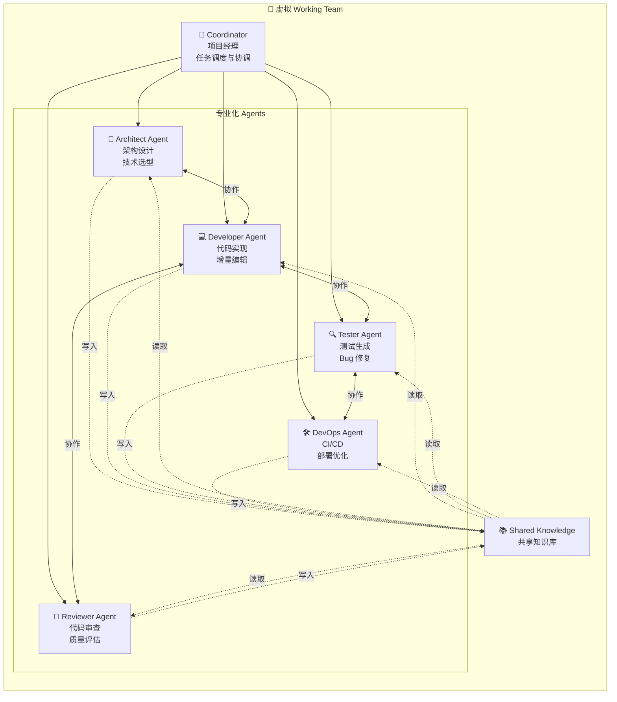
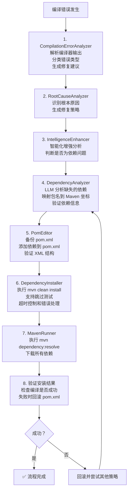
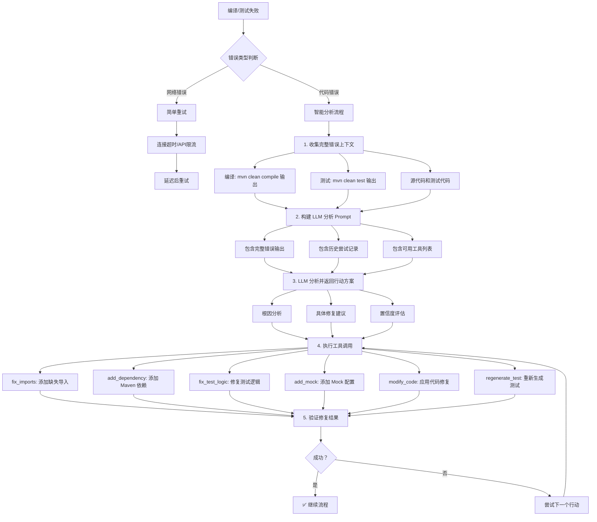
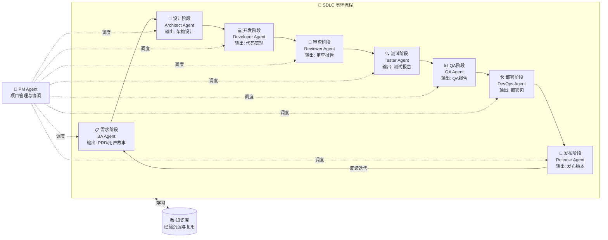

# PyUT Agent - 通用 Coding Agent 平台

> 🚀 **远景目标**：打造通用 Coding Agent 平台，构建虚拟 Working Team，让 AI 成为真正的开发伙伴

PyUT Agent 是一个**通用 Coding Agent 平台**，基于多智能体协作架构，支持对话式交互。它不仅专注于 Java 单元测试生成，更致力于成为开发者的全能 AI 助手。对标 Cursor/Devin/Cline 等顶级 Coding Agent，具备流式生成、增量编辑、错误学习、多智能体协作等高级能力。

---

## 🎯 远景与使命

### 虚拟 Working Team 愿景

我们不只是构建一个工具，而是在打造一个**虚拟 Working Team**——一个由专业化 AI Agent 组成的协作团队：

```
┌─────────────────────────────────────────────────────────────────┐
│                    虚拟 Working Team                             │
├─────────────┬─────────────┬─────────────┬─────────────────────┤
│   🎨 架构师  │   💻 开发者  │   🔍 测试员  │      🛠️ 运维工程师   │
│  Architect  │  Developer  │    Tester   │   DevOps Engineer   │
├─────────────┼─────────────┼─────────────┼─────────────────────┤
│  系统设计    │  代码实现    │  测试覆盖    │     CI/CD 配置      │
│  技术选型    │  代码重构    │  Bug 修复   │     部署优化        │
│  接口设计    │  性能优化    │  质量评估    │     监控告警        │
└─────────────┴─────────────┴─────────────┴─────────────────────┘
                           │
                    ┌──────┴──────┐
                    │  🤖 项目经理 │
                    │  Coordinator│
                    │  任务调度    │
                    │  进度跟踪    │
                    └─────────────┘
```

### 核心使命

- **🤖 通用性**：不限于 Java 单元测试，支持多语言、多框架、多场景
- **👥 协作性**：多智能体协作，各司其职，协同完成复杂任务
- **🧠 智能性**：持续学习、自我进化、智能决策
- **🔧 实用性**：深度集成开发工具链，真正提升开发效率
- **🌐 开放性**：开放架构，支持自定义 Agent 和能力扩展

---

## ✨ 特性

### 核心能力 (P0)
- 🤖 **Agent 架构**: 基于 LangChain 的 ReAct Agent，支持工具调用和规划
- 💬 **对话式 UI**: PyQt6 构建的图形界面，支持自然语言交互
- 🧠 **记忆系统**: 多层记忆（工作/短期/长期/向量），持续学习优化
- 🔍 **向量检索**: sqlite-vec 存储和检索相似代码模式
- ⏸️ **暂停/恢复**: 随时暂停生成任务，保存状态后可恢复
- 📊 **覆盖率分析**: 集成 JaCoCo，实时显示覆盖率报告
- 🔧 **LLM 配置**: 支持 OpenAI、Anthropic、DeepSeek、Ollama 等多种提供商

### 多智能体协作系统 (P2) 👥

虚拟 Working Team 的核心——专业化 Agent 协作：



**协作模式：**

| 模式 | 描述 | 适用场景 |
|-----|------|---------|
| **Sequential** | 顺序执行，前一个 Agent 完成后下一个开始 | 依赖明确的任务链 |
| **Parallel** | 并行执行，多个 Agent 同时工作 | 独立子任务并行处理 |
| **Hierarchical** | 主 Agent 协调，子 Agent 汇报 | 复杂项目分解 |
| **Collaborative** | 多 Agent 讨论协商，达成共识 | 需要多方意见的场景 |

### 自动化依赖恢复流程

当编译错误发生时，系统自动执行以下流程：



### 智能重试机制

测试生成过程中避免简单重试，通过 LLM 分析给出针对性修复方案。



### 核心架构重构 (2026-03-04 完成)
- 🏗️ **事件驱动架构**: EventBus 实现组件完全解耦，支持同步/异步事件
- 📦 **组件化系统**: ComponentRegistry 支持装饰器注册、自动发现、依赖管理
- 🔄 **状态管理**: Redux 风格的 StateStore，Action 模式保证状态可预测
- 💾 **多级缓存**: L1 内存 + L2 磁盘缓存，5-10 倍性能提升，支持压缩和预热
- 🎯 **智能聚类**: SmartClusterer 词向量语义分析，减少 60-80% LLM 调用
- 📊 **性能监控**: MetricsCollector 全面指标收集，PerformanceTracker 性能追踪
- ⚠️ **错误处理**: 统一错误类型、错误传播链、自动恢复策略
- 🔧 **Action 系统**: BatchAction、TransactionalAction、ConditionalAction、ActionSequence

### 增强能力 (P1)
- 📝 **流式代码生成**: 实时流式输出，支持用户中断和预览
- ✏️ **智能增量编辑**: Search/Replace 精确修改，unified diff 格式支持
- 📚 **错误模式学习**: 从历史错误中学习，持久化存储和推荐最佳策略
- 🎯 **提示词优化**: 模型特定的提示词优化，A/B 测试框架
- 🔧 **多构建工具**: 支持 Maven、Gradle、Bazel 自动检测
- 📊 **静态分析集成**: SpotBugs、PMD 静态分析集成

### 高级能力 (P2)
- 👥 **多智能体协作**: 专业化智能体（设计/实现/审查/修复）协作
- 🧩 **上下文智能压缩**: 大文件处理，关键片段提取，分层摘要
- 🔗 **多文件协调**: 跨文件理解和修改，依赖分析
- 🔄 **并行恢复**: 多路径并行尝试错误恢复
- 📈 **性能监控**: 全面的性能指标收集和报告

### 企业级能力 (P3)
- 🔮 **错误预测**: 编译前预测潜在错误，12种错误类型分类
- 🎛️ **自适应策略**: 根据历史动态调整策略，ε-贪婪算法
- 🛡️ **工具沙箱**: 安全沙箱隔离执行，3级安全控制
- 💾 **检查点恢复**: 断点续传，状态持久化
- 🧠 **智能代码分析**: 语义分析、依赖图、影响分析
- 🎯 **用户交互**: 交互式修复建议和确认

---

## 🚀 快速开始

### 环境要求
- Python 3.9+
- Maven 3.6+ (Java 项目)
- Java 11+

### 安装步骤

```bash
# 克隆仓库
git clone <repository-url>
cd auto-ut-agent

# 安装依赖
pip install -e .

# 或者开发模式安装
pip install -e ".[dev]"
```

### 运行

#### GUI 模式

```bash
# 启动图形界面
pyutagent

# 或者
python -m pyutagent
```

#### CLI 模式

```bash
# 查看帮助
pyutagent --help

# 扫描项目
pyutagent scan /path/to/maven/project

# 为单个文件生成测试
pyutagent generate /path/to/MyClass.java

# 批量生成测试
pyutagent generate-all /path/to/project --parallel 4

# 配置管理
pyutagent config llm list
pyutagent config maven show
```

详细 CLI 使用说明请参考 [CLI 使用指南](docs/cli_usage.md)。

---

## 📖 使用指南

### 1. 配置 LLM
- 点击菜单 `设置 -> LLM 配置`
- 选择提供商（OpenAI、Anthropic、DeepSeek、Ollama）
- 输入 API Key 和模型名称
- 点击 `测试连接` 验证配置
- 支持参数：Temperature、Max Tokens、Timeout、Retries

### 2. 打开项目
- 点击菜单 `文件 -> 打开项目`
- 选择一个 Maven 项目目录（包含 pom.xml）

### 3. 生成测试
- 在左侧文件树中选择一个 Java 文件
- 在对话区域输入: "生成 UserService 的测试"
- 或使用快捷键 `Ctrl+G`

### 4. 控制生成过程
- **暂停**: 输入 "暂停" 或点击暂停按钮
- **继续**: 输入 "继续" 恢复生成
- **查看状态**: 输入 "状态" 查看当前进度

### 5. 查看结果
- 生成的测试文件保存在 `src/test/java` 目录
- 覆盖率报告在右侧进度面板显示

---

## 🏗️ 架构设计

### 系统架构

```
┌─────────────────────────────────────────────────────────────────┐
│                        用户交互层                                │
│  ┌──────────────┐  ┌──────────────┐  ┌──────────────────────┐  │
│  │   PyQt6 GUI  │  │    CLI       │  │   VSCode Extension   │  │
│  └──────────────┘  └──────────────┘  └──────────────────────┘  │
└─────────────────────────────────────────────────────────────────┘
                              │
┌─────────────────────────────────────────────────────────────────┐
│                      Agent 协调层 (Coordinator)                   │
│         任务分解 · Agent 调度 · 进度跟踪 · 结果汇总               │
└─────────────────────────────────────────────────────────────────┘
                              │
┌─────────────────────────────────────────────────────────────────┐
│                     专业化 Agent 层                              │
│  ┌──────────┐ ┌──────────┐ ┌──────────┐ ┌──────────┐ ┌────────┐ │
│  │Architect │ │Developer │ │ Tester   │ │  DevOps  │ │Reviewer│ │
│  │  Agent   │ │  Agent   │ │  Agent   │ │  Agent   │ │ Agent  │ │
│  └──────────┘ └──────────┘ └──────────┘ └──────────┘ └────────┘ │
└─────────────────────────────────────────────────────────────────┘
                              │
┌─────────────────────────────────────────────────────────────────┐
│                      核心服务层                                  │
│  ┌──────────┐ ┌──────────┐ ┌──────────┐ ┌──────────┐ ┌────────┐ │
│  │ EventBus │ │StateStore│ │MessageBus│ │Component │ │Metrics │ │
│  │          │ │          │ │          │ │Registry  │ │        │ │
│  └──────────┘ └──────────┘ └──────────┘ └──────────┘ └────────┘ │
│  ┌──────────┐ ┌──────────┐ ┌──────────┐ ┌──────────┐ ┌────────┐ │
│  │  Memory  │ │  Vector  │ │  Cache   │ │  Error   │ │ Action │ │
│  │  System  │ │  Store   │ │  System  │ │ Handling │ │ System │ │
│  └──────────┘ └──────────┘ └──────────┘ └──────────┘ └────────┘ │
└─────────────────────────────────────────────────────────────────┘
                              │
┌─────────────────────────────────────────────────────────────────┐
│                       工具层                                     │
│  ┌──────────┐ ┌──────────┐ ┌──────────┐ ┌──────────┐ ┌────────┐ │
│  │  Java    │ │  Maven   │ │  Gradle  │ │  Static  │ │  LLM   │ │
│  │ Parser   │ │  Tools   │ │  Tools   │ │ Analysis │ │ Client │ │
│  └──────────┘ └──────────┘ └──────────┘ └──────────┘ └────────┘ │
└─────────────────────────────────────────────────────────────────┘
```

### 项目结构

```
pyutagent/
├── agent/                    # Agent 核心
│   ├── base_agent.py         # 基础 Agent
│   ├── react_agent.py        # ReAct Agent
│   ├── enhanced_agent.py     # 增强 Agent
│   ├── capability_registry.py # 能力注册表 ⭐ 专业化 Agent
│   ├── collaboration_orchestrator.py # 协作编排器 ⭐
│   ├── multi_agent/          # 多智能体系统
│   │   ├── agent_coordinator.py    # Agent 协调器
│   │   ├── specialized_agent.py    # 专业化 Agent
│   │   ├── message_bus.py          # 消息总线
│   │   └── shared_knowledge.py     # 共享知识库
│   └── ...
├── core/                     # 核心服务层 ⭐
│   ├── event_bus.py          # 事件总线
│   ├── state_store.py        # 状态管理
│   ├── component_registry.py # 组件注册表
│   ├── metrics.py            # 性能监控
│   └── ...
├── memory/                   # 记忆系统
│   ├── vector_store.py       # sqlite-vec 向量存储
│   ├── working_memory.py     # 工作记忆
│   └── ...
├── tools/                    # 工具层
│   ├── java_parser.py        # Java 代码解析
│   ├── maven_tools.py        # Maven 工具
│   └── ...
├── ui/                       # UI 层
│   ├── main_window.py        # 主窗口
│   └── ...
└── ...
```

⭐ = 核心架构模块

---

## 📊 CLI vs GUI 功能对比

| 功能 | CLI | GUI | 说明 |
|------|-----|-----|------|
| **测试生成** ||||
| 单文件生成 | ✅ `generate` | ✅ | CLI适合脚本化，GUI适合交互 |
| 批量生成 | ✅ `generate-all` | ✅ | 都支持并行和两阶段模式 |
| 项目扫描 | ✅ `scan` | ✅ | CLI列表/树形，GUI统计对话框 |
| **配置管理** ||||
| LLM配置 | ✅ `config llm` | ✅ | GUI有可视化对话框 |
| Maven配置 | ✅ `config maven` | ✅ | CLI和GUI功能对齐 |
| JDK配置 | ✅ `config jdk` | ✅ | CLI和GUI功能对齐 |
| **过程控制** ||||
| 暂停/恢复 | ⚠️ 有限 | ✅ | GUI有完整的暂停/恢复按钮 |
| 终止生成 | ✅ Ctrl+C | ✅ | 都支持 |
| **信息展示** ||||
| 实时日志 | ⚠️ 简单 | ✅ | GUI有详细日志面板 |
| 进度显示 | ✅ 进度条 | ✅ | GUI更直观 |
| **集成场景** ||||
| CI/CD集成 | ✅ 完美 | ❌ | CLI适合自动化流程 |
| 批处理脚本 | ✅ 完美 | ❌ | CLI适合批量处理 |
| 交互式使用 | ⚠️ | ✅ | GUI更适合日常使用 |

**选择建议：**
- **使用 CLI**：CI/CD 流程、批量脚本、自动化任务
- **使用 GUI**：日常开发、交互式生成、需要详细日志

---

## 🔌 支持的 LLM 提供商

| 提供商 | 默认 Endpoint | 推荐模型 |
|--------|--------------|---------|
| OpenAI | https://api.openai.com/v1 | gpt-4, gpt-4-turbo, gpt-3.5-turbo |
| Anthropic | https://api.anthropic.com/v1 | claude-3-opus, claude-3-sonnet |
| DeepSeek | https://api.deepseek.com/v1 | deepseek-chat, deepseek-coder |
| Ollama | http://localhost:11434/v1 | llama2, codellama, mistral |
| Custom | 自定义 | 任意兼容 OpenAI API 的模型 |

---

## ⚙️ 配置

### 环境变量

```bash
PYUT_LLM_PROVIDER=openai
PYUT_LLM_API_KEY=your-api-key
PYUT_LLM_MODEL=gpt-4
PYUT_TARGET_COVERAGE=0.8
PYUT_MAX_ITERATIONS=10
```

### 配置文件

配置保存在 `~/.pyutagent/config.json`：

```json
{
  "llm": {
    "provider": "openai",
    "endpoint": "https://api.openai.com/v1",
    "api_key": "sk-...",
    "model": "gpt-4",
    "temperature": 0.7,
    "max_tokens": 4096,
    "timeout": 300,
    "max_retries": 5
  }
}
```

---

## 🧪 测试

```bash
# 运行所有测试
pytest

# 运行单元测试
pytest tests/unit/ -v

# 运行集成测试
pytest tests/integration/ -v

# 运行性能基准测试
pytest tests/benchmarks/ -v

# 带覆盖率报告
pytest --cov=pyutagent --cov-report=html
```

### 测试统计

- **总测试数**: 480+
- **通过率**: 100%
- **执行时间**: ~35 秒
- **测试覆盖**: 核心模块、LLM 模块、Agent 模块、规划模块全覆盖

---

## 🛣️ 路线图

### 当前状态

PyUT Agent 已经实现了强大的 Java 单元测试生成能力，具备完整的多智能体协作架构。

### 短期目标 (2026 Q2)

- [ ] **多语言支持**: 扩展至 Python、TypeScript、Go 等语言
- [ ] **IDE 插件**: VSCode 和 IntelliJ 插件开发
- [ ] **更多 Agent 类型**: 安全审计 Agent、性能优化 Agent
- [ ] **知识库增强**: 项目级知识图谱构建

### 中期目标 (2026 Q3-Q4)

- [ ] **通用 Coding Agent**: 支持代码生成、重构、审查等全场景
- [ ] **团队协作**: 支持多人协作的 Agent 工作流
- [ ] **云端部署**: 支持 SaaS 模式和私有化部署
- [ ] **生态扩展**: 插件市场和自定义 Agent 开发框架

### 长期愿景 (2027+) - E2E Delivery Team

我们的终极目标是打造一个**完整的端到端交付团队 (E2E Delivery Team)**，覆盖完整的 SDLC（软件开发生命周期），实现从需求到交付的全流程自动化：

```
┌─────────────────────────────────────────────────────────────────────────────────┐
│                         E2E Delivery Team - 完整 SDLC 闭环                        │
├─────────────────────────────────────────────────────────────────────────────────┤
│                                                                                 │
│  ┌─────────────┐    ┌─────────────┐    ┌─────────────┐    ┌─────────────┐      │
│  │   📋 BA     │───→│   🎨 架构师  │───→│   💻 开发者  │───→│   🔍 测试员  │      │
│  │   Agent     │    │   Agent     │    │   Agent     │    │   Agent     │      │
│  │             │    │             │    │             │    │             │      │
│  │ • 需求分析   │    │ • 系统设计   │    │ • 代码实现   │    │ • 测试生成   │      │
│  │ • 用户故事   │    │ • 技术选型   │    │ • 代码重构   │    │ • Bug 修复  │      │
│  │ • 需求文档   │    │ • 架构文档   │    │ • 性能优化   │    │ • 质量评估   │      │
│  │ • 验收标准   │    │ • API 设计   │    │ • 单元测试   │    │ • 覆盖率分析  │      │
│  └─────────────┘    └─────────────┘    └─────────────┘    └─────────────┘      │
│         │                  │                  │                  │              │
│         └──────────────────┴──────────────────┴──────────────────┘              │
│                                    │                                            │
│                                    ▼                                            │
│  ┌─────────────┐    ┌─────────────┐    ┌─────────────┐    ┌─────────────┐      │
│  │   🔎 Code   │←───│   🛠️ DevOps │←───│   📊 QA     │←───│   🚀 Release│      │
│  │   Review    │    │   Agent     │    │   Agent     │    │   Agent     │      │
│  │   Agent     │    │             │    │             │    │             │      │
│  │             │    │ • CI/CD     │    │ • 集成测试   │    │ • 发布管理   │      │
│  │ • 代码审查   │    │ • 自动部署   │    │ • 验收测试   │    │ • 版本控制   │      │
│  │ • 安全审计   │    │ • 环境管理   │    │ • 性能测试   │    │ • 灰度发布   │      │
│  │ • 规范检查   │    │ • 监控告警   │    │ • 回归测试   │    │ • 回滚策略   │      │
│  └─────────────┘    └─────────────┘    └─────────────┘    └─────────────┘      │
│         │                                                            │          │
│         └────────────────────────┬───────────────────────────────────┘          │
│                                  ▼                                              │
│                       ┌─────────────────────┐                                   │
│                       │    🤖 Project       │                                   │
│                       │    Manager Agent    │                                   │
│                       │                     │                                   │
│                       │ • 项目规划与调度      │                                   │
│                       │ • 进度跟踪与汇报      │                                   │
│                       │ • 风险识别与预警      │                                   │
│                       │ • 资源协调与分配      │                                   │
│                       │ • 质量门禁把控        │                                   │
│                       └─────────────────────┘                                   │
│                                  │                                              │
│                                  ▼                                              │
│                       ┌─────────────────────┐                                   │
│                       │   📚 Knowledge      │                                   │
│                       │   Base & Learning   │                                   │
│                       │                     │                                   │
│                       │ • 项目知识图谱        │                                   │
│                       │ • 最佳实践沉淀        │                                   │
│                       │ • 跨项目经验迁移      │                                   │
│                       │ • 持续学习与进化      │                                   │
│                       └─────────────────────┘                                   │
│                                                                                 │
└─────────────────────────────────────────────────────────────────────────────────┘
```

**SDLC 各阶段 Agent 职责：**

| 阶段 | Agent | 核心职责 | 输出物 |
|-----|-------|---------|--------|
| **需求** | BA Agent | 需求分析、用户故事编写、验收标准定义 | PRD、用户故事、验收标准 |
| **设计** | Architect Agent | 系统设计、技术选型、API 设计 | 架构文档、技术方案、接口规范 |
| **开发** | Developer Agent | 代码实现、代码重构、性能优化 | 源代码、单元测试、技术文档 |
| **审查** | Reviewer Agent | 代码审查、安全审计、规范检查 | 审查报告、修复建议、质量评分 |
| **测试** | Tester Agent | 测试生成、Bug 修复、质量评估 | 测试用例、测试报告、覆盖率分析 |
| **QA** | QA Agent | 集成测试、验收测试、回归测试 | QA 报告、性能测试结果 |
| **运维** | DevOps Agent | CI/CD、自动部署、监控告警 | 流水线配置、部署脚本、监控面板 |
| **发布** | Release Agent | 发布管理、版本控制、灰度发布 | 发布计划、版本说明、回滚策略 |
| **管理** | PM Agent | 项目规划、进度跟踪、风险预警 | 项目计划、进度报告、风险清单 |

**E2E Delivery 流程：**



**核心能力目标：**

- [ ] **需求到代码 (Req2Code)**: BA Agent 生成需求，Developer Agent 直接实现
- [ ] **设计到部署 (Design2Deploy)**: Architect Agent 设计，DevOps Agent 自动部署
- [ ] **代码到生产 (Code2Prod)**: 一键完成从代码提交到生产发布的完整流程
- [ ] **全链路质量门禁**: 每个阶段都有质量检查，不合格自动打回
- [ ] **智能决策与优化**: PM Agent 根据项目状态智能调度资源、优化流程
- [ ] **知识沉淀与复用**: 项目经验自动沉淀，跨项目智能推荐最佳实践
- [ ] **人机协作模式**: 人类 PM 设定目标，Agent Team 自主执行，关键节点人工确认

**最终愿景：**

> 一个由人类项目经理领导的 AI 开发团队，能够独立完成从需求分析到生产交付的完整软件开发生命周期，实现真正的 **"AI-Native Software Development"**。

---

## 🤝 贡献

我们欢迎所有形式的贡献！无论是提交 Bug、建议新功能，还是贡献代码。

### 贡献指南

1. Fork 本仓库
2. 创建特性分支 (`git checkout -b feature/amazing-feature`)
3. 提交更改 (`git commit -m 'Add amazing feature'`)
4. 推送分支 (`git push origin feature/amazing-feature`)
5. 创建 Pull Request

---

## 📚 文档

- [架构文档](ARCHITECTURE.md) - 详细的架构说明
- [多智能体系统指南](docs/multi_agent_system_guide.md) - 多 Agent 协作详解
- [Sphinx 文档](docs/) - API 文档和使用指南

---

## 🛡️ 许可证

MIT License

---

## 🙏 致谢

感谢所有为 PyUT Agent 做出贡献的开发者。我们正在共同构建编程的未来——一个 AI 与人类开发者紧密协作的未来。

> *"The best way to predict the future is to invent it."* — Alan Kay

让我们一起打造最强大的通用 Coding Agent 平台！
