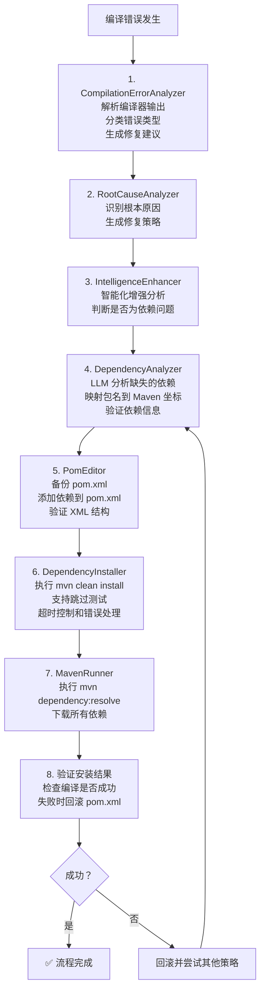

# PyUT Agent

AI 驱动的 Java 单元测试生成器，基于 Agent 架构，支持对话式交互。对标 Cursor/Devin/Cline 等顶级 Coding Agent，具备流式生成、增量编辑、错误学习、多智能体协作等高级能力。

## 特性

### 核心能力 (P0)
- 🤖 **Agent 架构**: 基于 LangChain 的 ReAct Agent，支持工具调用和规划
- 💬 **对话式 UI**: PyQt6 构建的图形界面，支持自然语言交互
- 🧠 **记忆系统**: 多层记忆（工作/短期/长期/向量），持续学习优化
- 🔍 **向量检索**: sqlite-vec 存储和检索相似测试模式
- ⏸️ **暂停/恢复**: 随时暂停生成任务，保存状态后可恢复
- 📊 **覆盖率分析**: 集成 JaCoCo，实时显示覆盖率报告
- 🔧 **LLM 配置**: 支持 OpenAI、Anthropic、DeepSeek、Ollama 等多种提供商

### 自动化依赖恢复流程

当编译错误发生时，系统自动执行以下流程：



**流程说明：**
1. **编译错误分析** - 解析编译器输出，识别错误类型和位置
2. **根因分析** - 深入分析错误的根本原因
3. **智能增强** - 使用 LLM 增强分析，判断错误类型
4. **依赖识别** - LLM 智能识别缺失的依赖，映射到 Maven 坐标
5. **安全修改** - 自动备份 pom.xml，添加依赖，验证 XML 结构
6. **依赖安装** - 执行 mvn clean install，支持跳过测试
7. **依赖解析** - 执行 mvn dependency:resolve 下载所有依赖
8. **验证回滚** - 验证安装结果，失败时自动回滚

**核心优势：**
- ✅ 多层分析架构：从简单解析 → 根因分析 → 智能增强
- ✅ LLM 增强：使用 LLM 进行智能依赖识别和映射
- ✅ 安全修改：自动备份、XML 验证、失败回滚
- ✅ 健壮执行：多平台 Maven 支持、超时控制、错误处理
- ✅ 异步优化：关键操作支持异步执行
- ✅ 测试保障：完善的单元测试覆盖

### 核心架构重构 (2026-03-04 完成)
- 🏗️ **事件驱动架构**: EventBus 实现组件完全解耦，支持同步/异步事件
- 📦 **组件化系统**: ComponentRegistry 支持装饰器注册、自动发现、依赖管理
- 🔄 **状态管理**: Redux 风格的 StateStore，Action 模式保证状态可预测
- 💾 **多级缓存**: L1 内存 + L2 磁盘缓存，5-10 倍性能提升，支持压缩和预热
- 🎯 **智能聚类**: SmartClusterer 词向量语义分析，减少 60-80% LLM 调用
- 📊 **性能监控**: MetricsCollector 全面指标收集，PerformanceTracker 性能追踪
- ⚠️ **错误处理**: 统一错误类型、错误传播链、自动恢复策略
- 🔧 **Action 系统**: BatchAction、TransactionalAction、ConditionalAction、ActionSequence

### 增强能力 (P1)
- 📝 **流式代码生成**: 实时流式输出，支持用户中断和预览
- ✏️ **智能增量编辑**: Search/Replace 精确修改，unified diff 格式支持
- 📚 **错误模式学习**: 从历史错误中学习，持久化存储和推荐最佳策略
- 🎯 **提示词优化**: 模型特定的提示词优化，A/B 测试框架
- 🔧 **多构建工具**: 支持 Maven、Gradle、Bazel 自动检测
- 📊 **静态分析集成**: SpotBugs、PMD 静态分析集成

### 高级能力 (P2)
- 👥 **多智能体协作**: 专业化智能体（设计/实现/审查/修复）协作
- 🧩 **上下文智能压缩**: 大文件处理，关键片段提取，分层摘要
- 🔗 **多文件协调**: 跨文件理解和修改，依赖分析
- 🔄 **并行恢复**: 多路径并行尝试错误恢复
- 📈 **性能监控**: 全面的性能指标收集和报告

### 企业级能力 (P3)
- 🔮 **错误预测**: 编译前预测潜在错误，12种错误类型分类
- 🎛️ **自适应策略**: 根据历史动态调整策略，ε-贪婪算法
- 🛡️ **工具沙箱**: 安全沙箱隔离执行，3级安全控制
- 💾 **检查点恢复**: 断点续传，状态持久化
- 🧠 **智能代码分析**: 语义分析、依赖图、影响分析
- 🎯 **用户交互**: 交互式修复建议和确认

## 安装

### 环境要求
- Python 3.9+
- Maven 3.6+
- Java 11+

### 安装步骤

```bash
# 克隆仓库
git clone <repository-url>
cd auto-ut-agent

# 安装依赖
pip install -e .

# 或者开发模式安装
pip install -e ".[dev]"
```

## 运行

### GUI 模式

```bash
# 启动图形界面
pyutagent

# 或者
python -m pyutagent
```

### CLI 模式

```bash
# 查看帮助
pyutagent --help

# 扫描项目
pyutagent scan /path/to/maven/project

# 为单个文件生成测试
pyutagent generate /path/to/MyClass.java

# 批量生成测试
pyutagent generate-all /path/to/project --parallel 4

# 配置管理
pyutagent config llm list
pyutagent config maven show
```

详细 CLI 使用说明请参考 [CLI 使用指南](docs/cli_usage.md)。

## 使用指南

### 1. 配置 LLM
- 点击菜单 `设置 -> LLM 配置`
- 选择提供商（OpenAI、Anthropic、DeepSeek、Ollama）
- 输入 API Key 和模型名称
- 点击 `测试连接` 验证配置
- 支持参数：Temperature、Max Tokens、Timeout、Retries

### 2. 打开项目
- 点击菜单 `文件 -> 打开项目`
- 选择一个 Maven 项目目录（包含 pom.xml）

### 3. 生成测试
- 在左侧文件树中选择一个 Java 文件
- 在对话区域输入: "生成 UserService 的测试"
- 或使用快捷键 `Ctrl+G`

### 4. 控制生成过程
- **暂停**: 输入 "暂停" 或点击暂停按钮
- **继续**: 输入 "继续" 恢复生成
- **查看状态**: 输入 "状态" 查看当前进度

### 5. 查看结果
- 生成的测试文件保存在 `src/test/java` 目录
- 覆盖率报告在右侧进度面板显示

## CLI vs GUI 功能对比

| 功能 | CLI | GUI | 说明 |
|------|-----|-----|------|
| **测试生成** ||||
| 单文件生成 | ✅ `generate` | ✅ | CLI适合脚本化，GUI适合交互 |
| 批量生成 | ✅ `generate-all` | ✅ | 都支持并行和两阶段模式 |
| 项目扫描 | ✅ `scan` | ✅ | CLI列表/树形，GUI统计对话框 |
| **配置管理** ||||
| LLM配置 | ✅ `config llm` | ✅ | GUI有可视化对话框 |
| Maven配置 | ✅ `config maven` | ✅ | CLI和GUI功能对齐 |
| JDK配置 | ✅ `config jdk` | ✅ | CLI和GUI功能对齐 |
| 覆盖率配置 | ✅ `config coverage` | ✅ | CLI和GUI功能对齐 |
| Aider配置 | ✅ `config aider` | ✅ | CLI和GUI功能对齐 |
| **过程控制** ||||
| 暂停/恢复 | ⚠️ 有限 | ✅ | GUI有完整的暂停/恢复按钮 |
| 终止生成 | ✅ Ctrl+C | ✅ | 都支持 |
| **信息展示** ||||
| 实时日志 | ⚠️ 简单 | ✅ | GUI有详细日志面板 |
| 进度显示 | ✅ 进度条 | ✅ | GUI更直观 |
| 项目历史 | ❌ | ✅ | GUI有最近项目列表 |
| **集成场景** ||||
| CI/CD集成 | ✅ 完美 | ❌ | CLI适合自动化流程 |
| 批处理脚本 | ✅ 完美 | ❌ | CLI适合批量处理 |
| 交互式使用 | ⚠️ | ✅ | GUI更适合日常使用 |

**选择建议：**
- **使用 CLI**：CI/CD 流程、批量脚本、自动化任务
- **使用 GUI**：日常开发、交互式生成、需要详细日志

## 支持的 LLM 提供商

| 提供商 | 默认 Endpoint | 推荐模型 |
|--------|--------------|---------|
| OpenAI | https://api.openai.com/v1 | gpt-4, gpt-4-turbo, gpt-3.5-turbo |
| Anthropic | https://api.anthropic.com/v1 | claude-3-opus, claude-3-sonnet |
| DeepSeek | https://api.deepseek.com/v1 | deepseek-chat, deepseek-coder |
| Ollama | http://localhost:11434/v1 | llama2, codellama, mistral |
| Custom | 自定义 | 任意兼容 OpenAI API 的模型 |

## 配置

### 环境变量

```bash
PYUT_LLM_PROVIDER=openai
PYUT_LLM_API_KEY=your-api-key
PYUT_LLM_MODEL=gpt-4
PYUT_TARGET_COVERAGE=0.8
PYUT_MAX_ITERATIONS=10
```

### 配置文件

配置保存在 `~/.pyutagent/config.json`：

```json
{
  "llm": {
    "provider": "openai",
    "endpoint": "https://api.openai.com/v1",
    "api_key": "sk-...",
    "model": "gpt-4",
    "temperature": 0.7,
    "max_tokens": 4096,
    "timeout": 300,
    "max_retries": 5
  }
}
```

## 测试

```bash
# 运行所有测试
pytest

# 运行单元测试
pytest tests/unit/ -v

# 运行集成测试
pytest tests/integration/ -v

# 运行性能基准测试
pytest tests/benchmarks/ -v

# 运行特定模块测试
pytest tests/unit/memory/
pytest tests/unit/tools/
pytest tests/unit/core/
pytest tests/unit/llm/
pytest tests/unit/agent/

# 带覆盖率报告
pytest --cov=pyutagent --cov-report=html
```

### 测试统计

- **总测试数**: 290+
- **通过率**: 100%
- **执行时间**: ~28 秒
- **测试覆盖**: 核心模块、LLM 模块、Agent 模块全覆盖

## 项目结构

```
pyutagent/
├── agent/                    # Agent 核心
│   ├── base_agent.py         # 基础 Agent
│   ├── react_agent.py        # ReAct Agent
│   ├── enhanced_agent.py     # 增强 Agent (P0/P1/P2/P3集成)
│   ├── integration_manager.py # 组件生命周期管理
│   ├── incremental_fixer.py  # 增量修复器 (P1)
│   ├── smart_clusterer.py    # 智能聚类算法 (P2)
│   ├── multi_agent/          # 多智能体系统 (P2)
│   │   ├── agent_coordinator.py    # 智能体协调器
│   │   ├── specialized_agent.py    # 专业化智能体
│   │   ├── message_bus.py          # 消息总线
│   │   └── shared_knowledge.py     # 共享知识库
│   ├── context_manager.py    # 上下文管理 (P0)
│   ├── generation_evaluator.py # 代码质量评估 (P0)
│   ├── partial_success_handler.py # 部分成功处理 (P0)
│   ├── prompt_optimizer.py   # 提示词优化 (P1)
│   ├── streaming.py          # 流式生成 (P0)
│   ├── smart_editor.py       # 智能编辑器 (P0)
│   ├── user_interaction.py   # 用户交互 (P3)
│   └── tool_validator.py     # 工具验证 (P3)
├── memory/                   # 记忆系统
│   ├── vector_store.py       # sqlite-vec 向量存储
│   ├── working_memory.py     # 工作记忆
│   ├── short_term_memory.py  # 短期记忆
│   └── context_compressor.py # 上下文压缩 (P1)
├── tools/                    # 工具
│   ├── java_parser.py        # Java 代码解析
│   ├── maven_tools.py        # Maven 工具
│   ├── build_tool_manager.py # 多构建工具支持 (P1)
│   ├── static_analysis_manager.py # 静态分析 (P1)
│   ├── smart_editor.py       # 智能编辑器 (P0)
│   ├── project_analyzer.py   # 项目分析器 (P1)
│   └── mcp_integration.py    # MCP 集成 (P1)
├── core/                     # 核心功能 ⭐ 重构完成
│   ├── event_bus.py          # 事件总线系统 ⭐
│   ├── state_store.py        # 状态管理 ⭐
│   ├── message_bus.py        # 消息总线 ⭐
│   ├── component_registry.py # 组件注册表 ⭐
│   ├── metrics.py            # 性能监控 ⭐
│   ├── error_handling.py     # 错误处理 ⭐
│   ├── error_types.py        # 错误类型定义 ⭐
│   ├── actions.py            # Action 系统扩展 ⭐
│   ├── state_persistence.py  # 状态持久化 ⭐
│   ├── state_snapshot.py     # 状态快照 ⭐
│   ├── error_recovery.py     # 错误恢复
│   ├── error_learner.py      # 错误学习 (P1)
│   ├── error_knowledge_base.py # 错误知识库 (P1)
│   ├── error_predictor.py    # 错误预测 (P3)
│   ├── adaptive_strategy.py  # 自适应策略 (P3)
│   ├── sandbox_executor.py   # 沙箱执行器 (P3)
│   ├── smart_analyzer.py     # 智能代码分析 (P3)
│   ├── code_interpreter.py   # 代码解释器 (竞争力)
│   ├── refactoring_engine.py # 重构引擎 (竞争力)
│   ├── test_quality_analyzer.py # 质量分析器 (竞争力)
│   ├── retry_manager.py      # 重试管理
│   ├── checkpoint.py         # 检查点管理 (P2)
│   ├── parallel_recovery.py  # 并行恢复 (P2)
│   └── container.py          # 依赖注入容器
├── llm/                      # LLM 相关
│   ├── config.py             # LLM 配置模型
│   ├── client.py             # LLM 客户端
│   ├── prompt_cache.py       # Prompt 缓存
│   ├── multi_level_cache.py  # 多级缓存 ⭐
│   └── model_router.py       # 模型路由器
├── ui/                       # UI 组件
│   ├── main_window.py        # 主窗口
│   ├── chat_widget.py        # 对话组件
│   └── dialogs/
│       └── llm_config_dialog.py  # LLM 配置对话框
├── main.py                   # 入口点
└── config.py                 # 配置管理
```

⭐ = 核心架构重构新增模块

## 技术栈

- **Python 3.12+**
- **PyQt6**: GUI 框架
- **LangChain**: Agent 框架
- **tree-sitter**: Java 代码解析
- **sqlite-vec**: 纯 Python 向量存储
- **JaCoCo**: Java 覆盖率分析
- **pytest**: 测试框架
- **asyncio**: 异步编程

## 文档

- [架构文档](ARCHITECTURE.md) - 详细的架构说明
- [Sphinx 文档](docs/) - API 文档和使用指南
  - [核心模块](docs/core/modules.rst)
  - [使用示例](docs/examples/basic_usage.rst)
  - [最佳实践](docs/best_practices/architecture.rst)

## 开发计划

### 已完成

- [x] 项目基础结构
- [x] sqlite-vec 向量存储
- [x] 记忆系统
- [x] Java 代码解析
- [x] Maven 工具
- [x] PyQt6 UI
- [x] LLM 配置功能
- [x] Agent 核心 (ReAct)
- [x] 对话管理器
- [x] 暂停/恢复功能

### P0 - 核心能力 (已完成)

- [x] **流式代码生成** - 实时流式输出，支持中断和预览
- [x] **上下文智能管理** - ContextManager 处理大文件，关键片段提取
- [x] **代码质量预评估** - GenerationEvaluator 6维度质量评估
- [x] **部分成功处理** - PartialSuccessHandler 增量测试修复
- [x] **智能增量编辑** - SmartCodeEditor Search/Replace 精确修改

### P1 - 重要能力 (已完成)

- [x] **提示词优化** - PromptOptimizer 模型特定优化，A/B 测试
- [x] **错误知识库** - ErrorKnowledgeBase SQLite 持久化学习
- [x] **多构建工具** - BuildToolManager Maven/Gradle/Bazel 支持
- [x] **静态分析** - StaticAnalysisManager SpotBugs/PMD 集成
- [x] **MCP 集成** - MCPIntegration Model Context Protocol 支持
- [x] **上下文压缩** - ContextCompressor 相关性评分和压缩
- [x] **项目分析** - ProjectAnalyzer 依赖分析和多文件协调

### P2 - 增强能力 (已完成)

- [x] **多智能体协作** - AgentCoordinator + SpecializedAgent 专业化分工
- [x] **消息总线** - MessageBus 异步通信基础设施
- [x] **共享知识库** - SharedKnowledgeBase 知识共享机制
- [x] **经验回放** - ExperienceReplay 经验学习和复用
- [x] **性能监控** - MetricsCollector 全面指标收集和报告
- [x] **集成管理层** - IntegrationManager 组件生命周期管理

### P3 - 高级能力 (已完成)

- [x] **错误预测** - 编译前预测潜在错误，12 种错误类型分类
- [x] **自适应策略** - 根据历史动态调整策略，ε-贪婪算法
- [x] **工具沙箱** - 安全沙箱隔离执行，3 级安全控制
- [x] **用户交互** - 交互式修复建议和确认
- [x] **智能代码分析** - 语义分析、依赖图、影响分析

### 竞争力功能 (已完成)

- [x] **代码解释器** - 安全测试代码执行、运行时错误捕获
- [x] **智能重构** - 12 种重构类型、自动重构执行
- [x] **质量分析器** - 6 维度质量评估、问题检测

### 核心架构重构 (2026-03-04 完成) ✨

- [x] **事件总线系统** - EventBus 10 个测试，组件解耦
- [x] **状态管理优化** - StateStore + StatePersistence + StateSnapshot 18 个测试
- [x] **消息总线** - MessageBus 16 个测试，发布/订阅模式
- [x] **组件注册表** - ComponentRegistry 17 个测试，装饰器注册
- [x] **性能监控** - Metrics + PerformanceTracker 27 个测试
- [x] **错误处理** - ErrorHandling + ErrorTypes 22 个测试
- [x] **Action 系统** - Batch/Transactional/Conditional/Sequence 23 个测试
- [x] **多级缓存** - MultiLevelCache L1+L2 30 个测试
- [x] **智能聚类** - SmartClusterer 词向量语义 27 个测试
- [x] **文档系统** - Sphinx 文档、使用示例、最佳实践

**总计**: 290+ 测试，100% 通过率，~28 秒执行时间

## 许可证

MIT License
